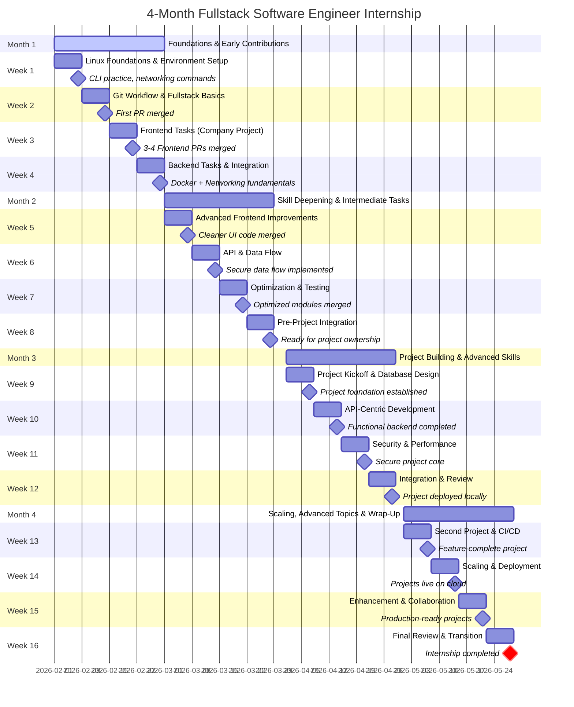
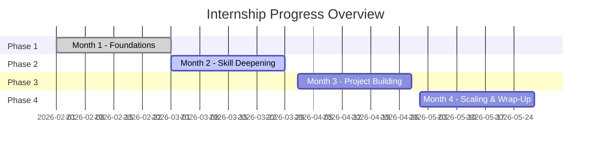

# Internship Program Timeline Chart

## 4-Month Fullstack Internship Roadmap

## Monthly Overview

## Key Milestones Summary

| Week | Milestone | Deliverables |
|------|-----------|--------------|
| 1 | Local dev environment ready | Linux CLI, Git, IDE, DB setup |
| 2 | First PR merged | Git workflow mastered |
| 3 | 3-4 Frontend PRs merged | UI bugs fixed, components enhanced |
| 4 | Frontend-backend integrated | Docker basics, networking fundamentals |
| 5 | Cleaner UI code | Refactored components, state management |
| 6 | Secure data flow | Auth APIs, validation, error handling |
| 7 | Optimized modules | Performance tuning, E2E tests |
| 8 | Ready for project ownership | Integrated feature complete |
| 9 | Project foundation | Requirements, DB schema, migrations |
| 10 | Functional backend | Core APIs, pagination, caching |
| 11 | Secure project core | Auth/authz, monitoring, logging |
| 12 | Project deployed locally | Full integration, demo ready |
| 13 | Feature-complete project | Second project, CI/CD pipeline |
| 14 | Projects live on cloud | Docker, cloud deployment, CDN |
| 15 | Production-ready projects | Feedback improvements, collaboration |
| 16 | Internship completed | Portfolio, presentation, job prep |

## Skill Progression

```mermaid
graph LR
    subgraph "Month 1: Foundations"
        A[Linux CLI] --> B[Git]
        B --> C[Frontend Basics]
        C --> D[Backend Basics]
    end

    subgraph "Month 2: Deepening"
        D --> E[Advanced Frontend]
        E --> F[API Security]
        F --> G[Testing]
        G --> H[Integration]
    end

    subgraph "Month 3: Building"
        H --> I[DB Design]
        I --> J[API Development]
        J --> K[Security]
        K --> L[Full Project]
    end

    subgraph "Month 4: Scaling"
        L --> M[CI/CD]
        M --> N[Cloud Deploy]
        N --> O[Production]
        O --> P[Junior Engineer]
    end
```

## Expected Outcomes by Month

| Month | PRs Expected | Key Skills | Projects |
|-------|--------------|------------|----------|
| 1 | 5-8 PRs | Linux, Git, Basic fullstack | - |
| 2 | 10-12 PRs | APIs, Testing, Security basics | - |
| 3 | Project-based | System design, Performance | 1-2 complete |
| 4 | Polish & deploy | CI/CD, Cloud, DevOps | 2-3 polished |
