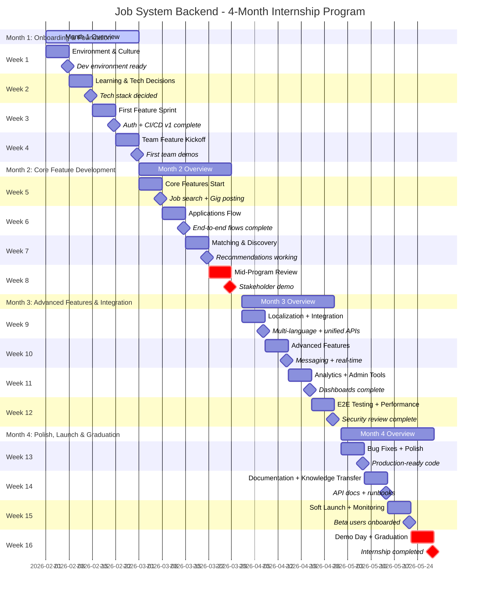
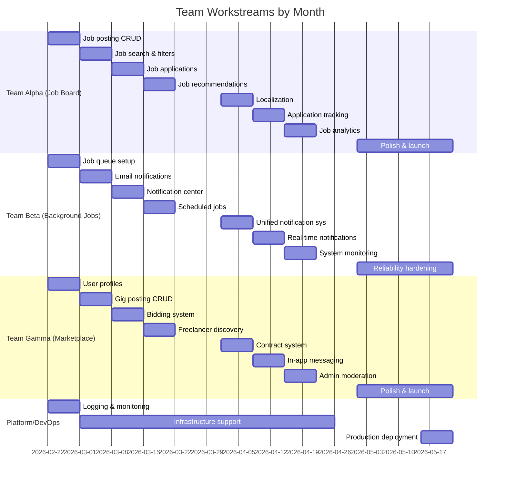
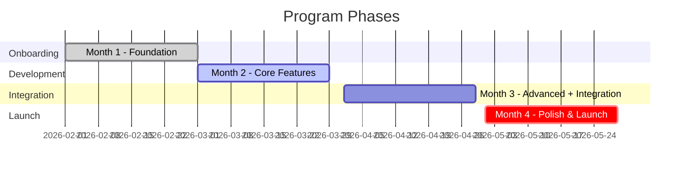
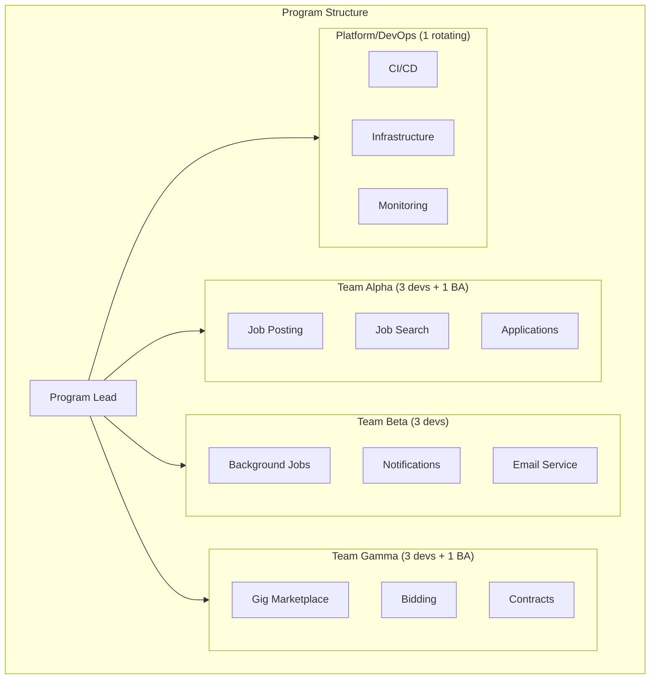

# Internship Program Timeline Chart

## Program Overview

- **Duration:** 4 months (16 weeks)
- **Team:** 10 full-stack interns + 2 Business Analysts
- **Commitment:** Part-time (~20-25 hrs/week)
- **Project:** Job System Backend (Job Board, Background Jobs, Freelance Marketplace)

---

## 4-Month Program Timeline

---

## Team Parallel Workstreams

---

## Monthly Phase Overview

---

## Key Milestones Summary

| Week | Phase | Milestone | Deliverables |
|------|-------|-----------|--------------|
| 1 | Foundation | Dev environment ready | Tools installed, hello world PR |
| 2 | Foundation | Tech stack decided | Node.js/PHP/Python decision, Git workflow guide |
| 3 | Foundation | Auth + CI/CD v1 | Working auth flow, auto-deploy to staging |
| 4 | Foundation | First team demos | Each team ships first feature |
| 5 | Core Dev | Job search + Gig posting | Search API, gig CRUD complete |
| 6 | Core Dev | Application flows | Apply to job, bid on gig working |
| 7 | Core Dev | Matching & Discovery | Recommendations, scheduled jobs |
| 8 | Core Dev | **Mid-Program Review** | Stakeholder demo, integration plan |
| 9 | Integration | Multi-language support | i18n in 2 languages, unified APIs |
| 10 | Integration | Advanced interactions | Messaging, real-time notifications |
| 11 | Integration | Analytics + Admin | Dashboards, admin moderation |
| 12 | Integration | Quality assurance | E2E tests, security review |
| 13 | Launch | Production-ready | Bug fixes, UI polish |
| 14 | Launch | Documentation | API docs, runbooks, architecture |
| 15 | Launch | **Soft Launch** | Beta users, live monitoring |
| 16 | Launch | **Demo Day + Graduation** | Final presentations, certificates |

---

## Team Structure

---

## Skills Progression

```mermaid
graph LR
    subgraph "Month 1"
        A1[Git workflow]
        A2[Environment setup]
        A3[Basic CRUD]
        A1 --> A2 --> A3
    end

    subgraph "Month 2"
        B1[API design]
        B2[Database modeling]
        B3[Testing]
        A3 --> B1 --> B2 --> B3
    end

    subgraph "Month 3"
        C1[Integration]
        C2[Performance]
        C3[Security basics]
        B3 --> C1 --> C2 --> C3
    end

    subgraph "Month 4"
        D1[Deployment]
        D2[Monitoring]
        D3[Documentation]
        C3 --> D1 --> D2 --> D3
    end
```

| Month | Technical Skills | Soft Skills |
|-------|------------------|-------------|
| 1 | Git, environment setup, basic CRUD | Standups, code reviews, team communication |
| 2 | API design, database modeling, testing | Estimating work, asking for help, documentation |
| 3 | Integration, performance, security basics | Cross-team collaboration, debugging production |
| 4 | Deployment, monitoring, documentation | Presenting, knowledge transfer, ownership |

---

## Weekly Rituals

| Ritual | Frequency | Duration | Purpose |
|--------|-----------|----------|---------|
| Daily standup | Daily | 15 min | Quick sync, blockers |
| Sprint planning | Monday | 1 hr | Plan week's work |
| Code review sessions | Ongoing | - | Quality + learning |
| Friday showcase | Friday | 1 hr | Demo progress, celebrate wins |
| Retrospective | Bi-weekly | 1 hr | Process improvement |
| Cross-team sync | Weekly (Month 2+) | 30 min | Integration alignment |
| 1:1 with mentor | Weekly | 30 min | Personal growth, feedback |

---

## Success Metrics

| Metric | Target |
|--------|--------|
| **Product** | MVP deployed with 10+ beta users |
| **Code Quality** | 80%+ test coverage on critical paths |
| **Learning** | Each intern can explain full system architecture |
| **Team** | 70%+ of interns ready for junior dev roles |
| **Documentation** | Complete API docs + runbooks |
